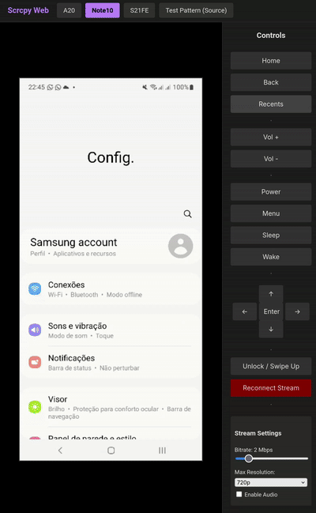

# Scrcpy Web Interface

A Node.js application for remote control of Android devices connected via USB. This project was developed and tested on Linux (specifically Ubuntu) using `gemini-cli` agent, but it is designed to be portable. It uses a local build of `scrcpy` for high-performance streaming and `adb` for control commands.

## Features

- **High-Performance Streaming:** Uses `scrcpy` (v3.x) with a FIFO pipeline and `ffmpeg` to deliver a raw H.264 stream (Baseline profile) compatible with browser decoding via `jmuxer`.
- **Low Latency:** Optimized for local network usage with minimal buffering.
- **Device Tabs:** Tabbed interface to easily switch between multiple connected phones.
- **Remote Controls:**
  - Sidebar buttons for Home, Back, Menu, Volume, Power.
  - D-Pad navigation.
  - "Swipe Up" macro for unlocking.
- **Mouse & Scroll:** Click to tap, scroll wheel to swipe up/down.
- **Stream Settings:** Adjustable Bitrate (1-8 Mbps) and Resolution (480p, 720p, 1080p, Native) to optimize for stability or quality.
- **Auto-detection:** Automatically detects devices connected via ADB and populates `phones.json`.
- **Security:** Configurable Basic Authentication.

## Quick Demo


## Project Architecture

- `server.js`: Express and Socket.io server. Manages the `scrcpy` -> FIFO -> `ffmpeg` pipeline.
- `public/`: Frontend of the application.
  - `index.html`: Main dashboard layout with video player and controls.
  - `js/app.js`: Frontend logic (Socket.io handling, JMuxer setup, UI events).
  - `css/style.css`: Dark mode styling.
- `scrcpy/`: Submodule containing the `scrcpy` source and built binaries.
- `phones.json`: JSON database of configured devices (auto-generated).
- `.env`: Environment variables (Port, Credentials).

## Prerequisites

- Linux (Ubuntu 24.04 or compatible recommended, might work on windows with minor tweaks)
- Node.js (v18+) and NPM
- `adb` (Android Debug Bridge) installed system-wide.
- `ffmpeg` installed system-wide (Required for stream processing).
- Build tools (`gcc`, `git`, `pkg-config`, `meson`, `ninja`, etc.) to build `scrcpy` initially.
- USB access to Android devices with USB debugging enabled.

## Installation

1. **System Dependencies:**
   Install the required packages to build `scrcpy` and run the project:
   ```bash
   sudo apt update
   # Runtime dependencies
   sudo apt install adb ffmpeg libsdl2-2.0-0 libusb-1.0-0
   # Build dependencies for scrcpy
   sudo apt install gcc git pkg-config meson ninja-build libsdl2-dev \
                    libavcodec-dev libavdevice-dev libavformat-dev libavutil-dev \
                    libswresample-dev libusb-1.0-0-dev
   ```

2. **Build Scrcpy:**
   The project includes `scrcpy` as a submodule. Build it manually to generate the local binaries used by the server:
   ```bash
   cd scrcpy
   # Use the install script to download prebuilt server and build client
   ./install_release.sh
   # OR build manually with meson
   # meson setup x --buildtype=release --strip -Db_lto=true
   # ninja -Cx
   cd ..
   ```
   *Note: The server expects the binary at `scrcpy/build-auto/app/scrcpy`.*

3. **Install Project Dependencies:**
   ```bash
   npm install
   ```

4. **Configuration:**
   Copy the example file and edit as needed:
   ```bash
   cp .env.example .env
   nano .env
   ```
   Set the username and password for Basic Auth.

## Usage

1. **Connect Devices:**
   Connect phones via USB. Verify they are authorized:
   ```bash
   adb devices
   ```
   If `unauthorized` appears, accept the prompt on the phone's screen.

2. **Start the Server:**
   For development/testing:
   ```bash
   node server.js
   ```

   For production (using PM2):
   ```bash
   pm2 start ecosystem.config.js
   pm2 save
   pm2 startup
   ```

3. **Access:**
   Open your browser and go to `http://SERVER-IP:8558`.
   Enter the credentials configured in `.env`.

## Troubleshooting

- **Black Screen:**
  - Try lowering the resolution (Max Resolution: 720p or 480p) and Bitrate in the Stream Settings.
  - Ensure the device screen is on (the "Wake" button can help).
- **Stream Stopped:**
  - Click "Reconnect Stream".
  - Check server logs (`pm2 logs scrcpy-web`) for errors.
- **Device Not Found:**
  - Ensure `adb devices` shows the device.
  - Delete `phones.json` and restart the server to re-detect devices.
